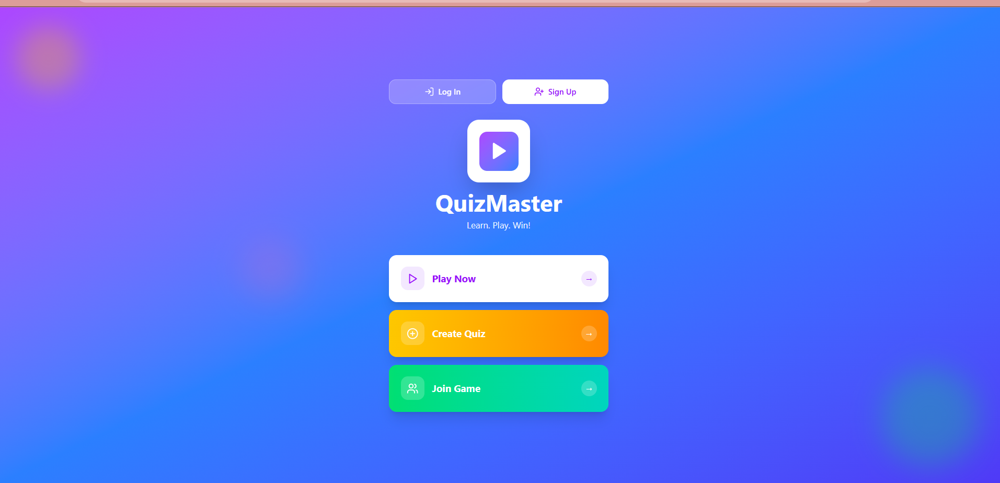
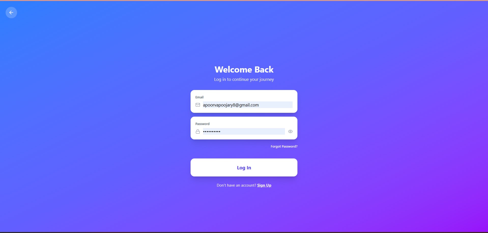
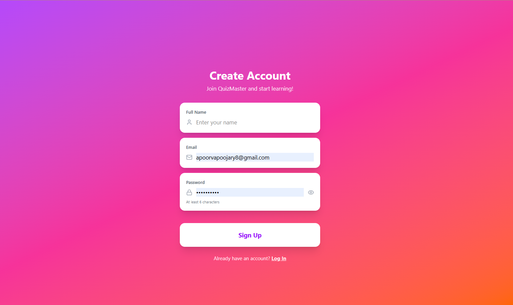
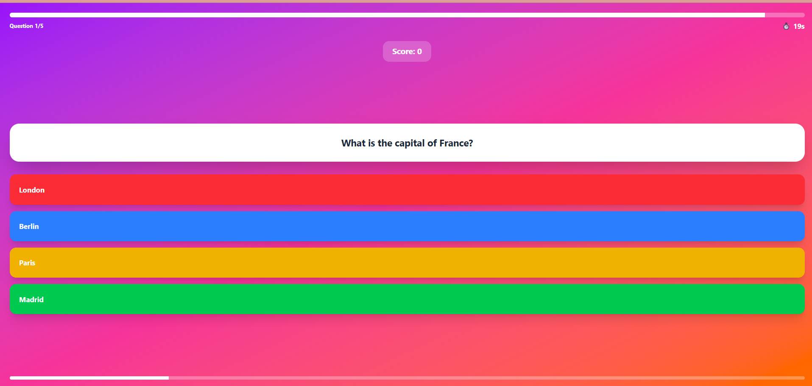

# 🧠 QuizMaster

A modern full-stack quiz platform to create, attempt, and compete in quizzes with real-time scoring and analytics.

---

## 🚀 Features

- 🔐 User Authentication (Signup / Login)
- 📝 Create and manage quizzes
- ⏱️ Timer-based quiz sessions
- 📊 Score tracking & analytics
- 🏆 Leaderboard system
- 📱 Fully responsive UI

---

## 🏗️ Tech Stack

### 🎨 Frontend
- React.js
- TypeScript
- Vite
- Tailwind CSS
- shadcn/ui

### ⚙️ Backend
- Node.js
- Express.js
- TypeScript

### 🗄️ Database
- MongoDB

### 🛠️ Tools
- pnpm
- PostCSS
- Git
- Figma

---

## 📂 Project Structure
QuizMaster/
│
├── frontend/ # React + Vite + TypeScript
├── backend/ # Node.js + Express + TypeScript
└── README.md


---

Your formatting broke because Markdown needs **proper code blocks + spacing**.
Here is the **fixed, clean version** — copy-paste directly 👇

````markdown
---

## ⚡ Getting Started

### 1. Clone the Repository

```bash
git clone https://github.com/your-username/QuizMaster.git
cd QuizMaster
````

---

### 2. Setup Backend

```bash
cd backend
pnpm install
```

---

### 3. Setup Frontend

```bash
cd frontend
pnpm install
pnpm dev
```

---

## 🌐 Environment Variables

| Variable   | Description               |
| ---------- | ------------------------- |
| MONGO_URI  | MongoDB connection string |
| JWT_SECRET | Secret key for auth       |
| PORT       | Backend server port       |

---

## 📸 Screenshots

*Add your UI screenshots here*






---

## 📄 License

MIT License

---

## 👩‍💻 Author

**Apoorva**


---


